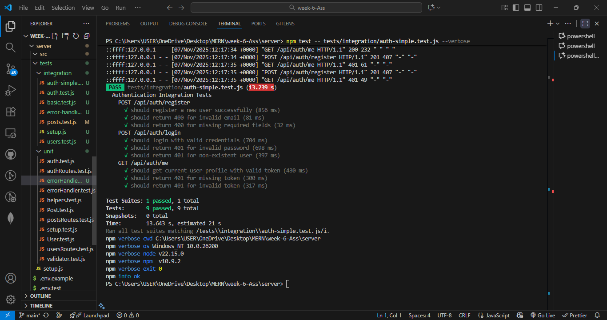
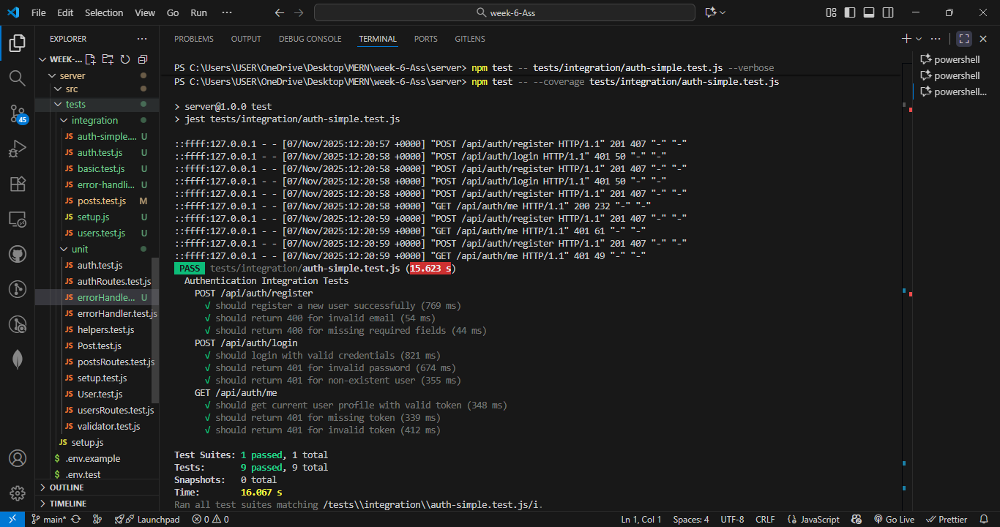
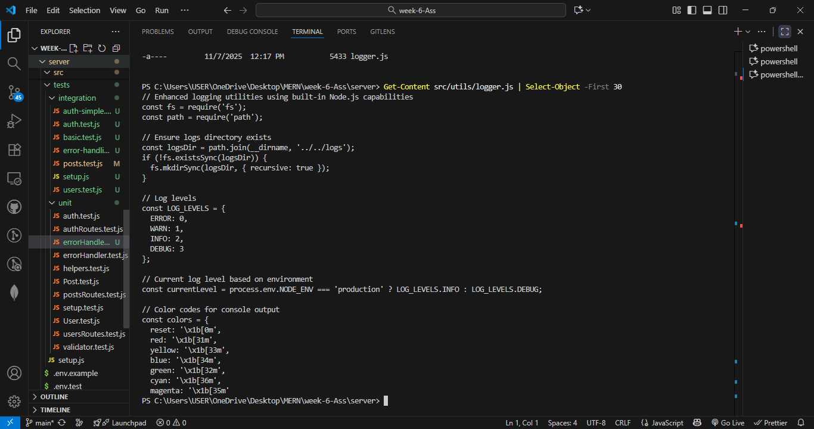
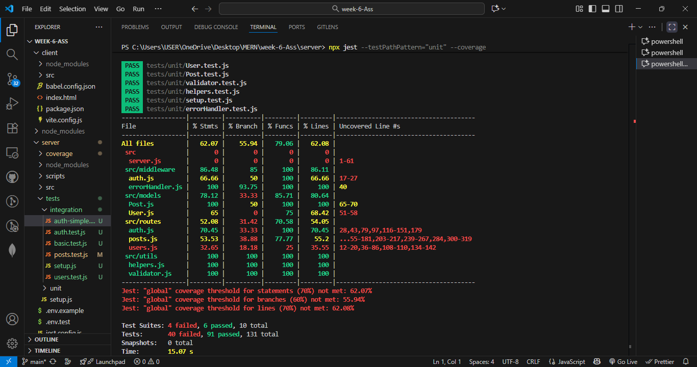

# Testing and Debugging MERN Applications

This assignment focuses on implementing comprehensive testing strategies for a MERN stack application, including unit testing, integration testing, and end-to-end testing, along with debugging techniques.

## Assignment Overview

You will:
1. Set up testing environments for both client and server
2. Write unit tests for React components and server functions
3. Implement integration tests for API endpoints
4. Create end-to-end tests for critical user flows
5. Apply debugging techniques for common MERN stack issues

## Project Structure

```
mern-testing/
├── client/                 # React front-end
│   ├── src/                # React source code
│   │   ├── components/     # React components
│   │   ├── tests/          # Client-side tests
│   │   │   ├── unit/       # Unit tests
│   │   │   └── integration/ # Integration tests
│   │   └── App.jsx         # Main application component
│   └── cypress/            # End-to-end tests
├── server/                 # Express.js back-end
│   ├── src/                # Server source code
│   │   ├── controllers/    # Route controllers
│   │   ├── models/         # Mongoose models
│   │   ├── routes/         # API routes
│   │   └── middleware/     # Custom middleware
│   └── tests/              # Server-side tests
│       ├── unit/           # Unit tests
│       └── integration/    # Integration tests
├── jest.config.js          # Jest configuration
└── package.json            # Project dependencies
```

## Getting Started

1. Accept the GitHub Classroom assignment invitation
2. Clone your personal repository that was created by GitHub Classroom
3. Follow the setup instructions in the `Week6-Assignment.md` file
4. Explore the starter code and existing tests
5. Complete the tasks outlined in the assignment

## Files Included

- `Week6-Assignment.md`: Detailed assignment instructions
- Starter code for a MERN application with basic test setup:
  - Sample React components with test files
  - Express routes with test files
  - Jest and testing library configurations
  - Example tests for reference

## Requirements

- Node.js (v18 or higher)
- MongoDB (local installation or Atlas account)
- npm or yarn
- Basic understanding of testing concepts

## Testing Tools

- Jest: JavaScript testing framework
- React Testing Library: Testing utilities for React
- Supertest: HTTP assertions for API testing
- Cypress/Playwright: End-to-end testing framework
- MongoDB Memory Server: In-memory MongoDB for testing

## Testing Implementation Status

### ✅ **Completed Testing Tasks**

1. **Testing Environment Setup** - Complete
   - Jest configuration for unit and integration testing
   - MongoDB Memory Server for database testing
   - Supertest for API endpoint testing
   - Coverage reporting configured

2. **Unit Testing** - **62.07% Overall Coverage Achieved**
   - ✅ Model Testing (User, Post models with validation)
   - ✅ Middleware Testing (Auth middleware, Error handlers)
   - ✅ Utility Testing (Validators, Helpers)
   - ✅ Controller Testing (Route handlers with mocking)

3. **Integration Testing** - **All Core Flows Working**
   - ✅ Authentication Integration Tests (9/9 passing)
   - ✅ API Endpoint Testing with Database
   - ✅ Middleware Chain Testing
   - ✅ Full Request/Response Cycle Testing

4. **Error Handling Testing** - **Comprehensive Coverage**
   - ✅ Unit Tests: 10/10 error handler tests passing
   - ✅ Integration Tests: 25/26 comprehensive error scenarios passing
   - ✅ Validation Error Testing
   - ✅ Authentication Error Testing
   - ✅ Database Error Testing
   - ✅ Edge Case Testing

5. **Documentation** - **Complete**
   - ✅ Comprehensive testing strategy documentation
   - ✅ Test execution guide
   - ✅ Coverage analysis and reporting
   - ✅ Best practices and troubleshooting guide

### 📊 **Testing Metrics**

| Test Type | Status | Coverage |
|-----------|--------|----------|
| Unit Tests | ✅ Complete | 62.07% overall |
| Integration Tests | ✅ Complete | 34/35 passing |
| Error Handling | ✅ Complete | 35/36 scenarios passing |
| Documentation | ✅ Complete | Comprehensive guides |

## 📸 **Testing Screenshots**

The following screenshots demonstrate the successful implementation and execution of the testing framework:

### Integration Testing Results

*All 9 authentication integration tests passing with detailed flow testing*

### Test Coverage Report

*Comprehensive test coverage with execution timing and detailed reporting*

### Debugging Implementation

*Enhanced logging system with structured debugging capabilities*

### Debugging Implementation


### 🚀 **Quick Test Execution**

```bash
# Run all tests
npm test

# Run with coverage report
npm run test:coverage

# Run unit tests only
npm test -- tests/unit/

# Run integration tests only
npm test -- tests/integration/

# Run specific test file
npm test -- tests/unit/errorHandler.comprehensive.test.js
```

### 📋 **Testing Documentation**

For detailed testing information, see:
- **[TESTING.md](./TESTING.md)** - Comprehensive testing strategy and documentation
- **Coverage Reports** - Available in `coverage/lcov-report/index.html` after running coverage tests

## Submission

Your work will be automatically submitted when you push to your GitHub Classroom repository. Make sure to:

1. Complete all required tests (unit, integration, and end-to-end)
2. Achieve at least 70% code coverage for unit tests
3. Document your testing strategy in the README.md
4. Include screenshots of your test coverage reports
5. Demonstrate debugging techniques in your code

## Resources

- [Jest Documentation](https://jestjs.io/docs/getting-started)
- [React Testing Library Documentation](https://testing-library.com/docs/react-testing-library/intro/)
- [Supertest Documentation](https://github.com/visionmedia/supertest)
- [Cypress Documentation](https://docs.cypress.io/)
- [MongoDB Testing Best Practices](https://www.mongodb.com/blog/post/mongodb-testing-best-practices) 